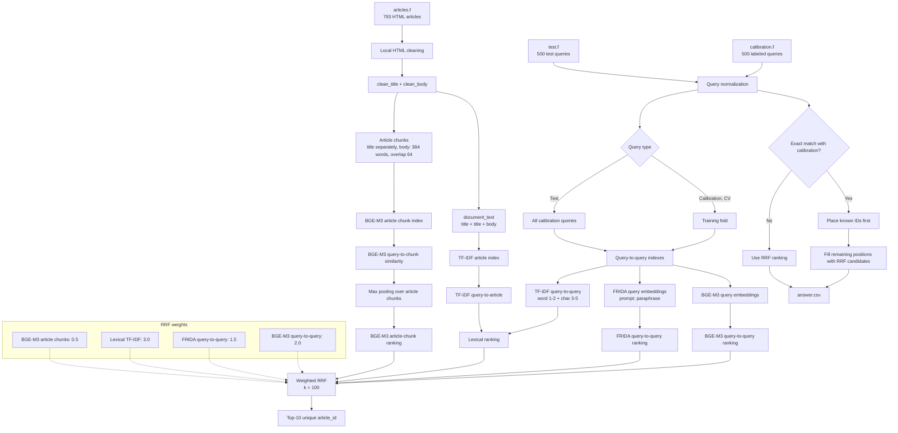

# Hybrid Retrieval For Avito Help Articles

## Result

Selected local hybrid retrieval reaches **MAP@10 = 0.6488** in 5-fold cross-validation on public `calibration.f`.


## Data Preparation



`avito_retrieval/data.py` loads `articles.f`, `calibration.f`, and `test.f` deterministically. The space-separated `ground_truth` values in calibration are parsed into tuples of article IDs.

Article HTML is normalized locally in this order:

1. HTML entities are decoded.
2. `script` and `style` blocks are removed.
3. Dataset placeholders such as `<PLACEHOLDER>` are preserved as text.
4. Remaining tags and URLs are removed.
5. Whitespace is collapsed and text is lowercased.

For each article, the pipeline creates `clean_title`, `clean_body`, and `document_text = title + title + body`. Repeating the title gives the article subject more influence in lexical retrieval. For dense article retrieval, every title is a separate chunk and the body is split into 384-word chunks with 64-word overlap.

## Retrieval Signals

The ranker combines four independent local channels.

### Lexical TF-IDF

`LexicalRetriever` uses word TF-IDF 1-2 grams for query-to-query and query-to-article matching, character TF-IDF 3-5 grams for query-to-query matching, and normalized weighted scores:

```text
0.45 * word-query + 0.40 * char-query + 0.15 * document-word
```

Query-to-query matches a new query with labeled calibration queries. Similar calibration queries transfer their associated article IDs as candidates.

### BGE-M3 Query-To-Query

`BAAI/bge-m3` creates 1024-dimensional L2-normalized embeddings. Each article receives the maximum cosine similarity to any calibration query labeled with it.

### FRIDA Query-To-Query

`ai-forever/FRIDA` supplies a second semantic ranking. It uses FRIDA's `paraphrase` prompt and the same maximum-cosine aggregation.

### BGE-M3 Article Chunks

Each query is compared with BGE-M3 embeddings of all title/body chunks. The score of an article is the maximum similarity of its chunks. This can retrieve articles that lack close calibration examples.

## Fusion

TF-IDF and cosine scores are on incomparable scales, so the pipeline fuses rankings with weighted Reciprocal Rank Fusion:

```text
RRF(article) = sum(channel_weight / (100 + rank_in_channel))
```

| Channel | Weight |
| --- | ---: |
| BGE-M3 query-to-query | 2.0 |
| FRIDA query-to-query | 1.5 |
| Lexical TF-IDF | 3.0 |
| BGE-M3 article chunks | 0.5 |

The final answer is the ten highest-scoring unique IDs. There is one general exact-match retrieval rule: if a normalized test query exactly matches a normalized calibration query, its known calibration IDs are placed first, then RRF candidates fill the remaining positions. This uses only supplied training data; it does not depend on a specific `query_id`.

## Validation

The quality estimate uses `KFold(n_splits=5, shuffle=True, random_state=42)` and task MAP@10.

1. A fold's query-to-query index contains only its training calibration queries.
2. TF-IDF is fitted only on training queries plus the fixed article corpus.
3. Validation queries never retrieve their own labels.
4. AP@10 is computed for each validation query and averaged.

| Configuration | MAP@10 |
| --- | ---: |
| TF-IDF baseline | 0.5679 |
| FRIDA query-to-query | 0.5846 |
| BGE-M3 query-to-query | 0.5988 |
| BGE-M3 article chunks | 0.3118 |
| Equal-weight RRF | 0.6193 |
| Selected weighted RRF | **0.6488** |

## Error Analysis

- Raw article HTML contains tags, URLs, scripts, styles, and placeholders. Cleaning removes noise while retaining meaningful placeholders.
- A relevant paragraph can be diluted in a long article. Overlapping chunks and max pooling retain the strongest passage match.
- Short queries, typos, and Russian word forms reduce exact word overlap. Character TF-IDF and two dense models make retrieval more robust.
- Calibration labels cover only a subset of articles. The direct article-chunk channel expands candidate coverage.
- Directly summing raw scores favored channels with larger numeric scales. RRF uses rank positions instead.

## Models And Constraints

All inference runs locally. The code makes no external API calls and does not fine-tune models.

| Resource | Use | Size |
| --- | --- | ---: |
| `BAAI/bge-m3` | dense retrieval | about 0.57B parameters |
| `ai-forever/FRIDA` | dense retrieval | 0.8B parameters |
| `scikit-learn` | TF-IDF and cross-validation | classical ML |
| `sentence-transformers`, `torch`, `transformers` | local embedding inference | libraries |

Both final embedding models are below the 1B-parameter limit. Qwen3-Embedding-0.6B was evaluated during experimentation but is not used by the submitted pipeline.

## Reproduction

Dependencies are locked in `uv.lock`. To run the notebook on a new platform, place `candidate_public.zip` in the project root. Section 0 extracts it into `candidate_public/` and locates `candidate_data`; section 0.1 downloads BGE-M3 and FRIDA into `models/` only if they are absent.

For standalone submission generation, extract the data so it is available at `candidate_public/candidate_data/`, then download the models once:

```bash
uv sync
uv run hf download BAAI/bge-m3 --local-dir models/bge-m3
uv run hf download ai-forever/FRIDA --local-dir models/frida
uv run python make_submission.py
```

`make_submission.py` reuses or locally creates vectors under `cache/`, then writes `answer.csv`. With the same data, local model files, locked environment, and device, it recreates the submitted ranking. `main.ipynb` section 6 calls this same pipeline and validates the columns, query order, unique IDs, and top-10 limit.
