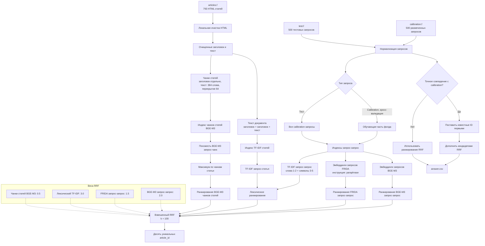

# Гибридный поиск статей поддержки

## Результат

Выбранный локальный гибридный поиск достигает **MAP@10 = 0.6488** при 5-fold кросс-валидации на публичной `calibration.f`.


## Подготовка данных



`avito_retrieval/data.py` детерминированно загружает `articles.f`, `calibration.f` и `test.f`. Значения `ground_truth` из calibration разбираются как кортежи article ID, разделенных пробелами.

HTML статей нормализуется локально в следующем порядке:

1. Декодируются HTML-сущности.
2. Удаляются блоки `script` и `style`.
3. Плейсхолдеры датасета, например `<PLACEHOLDER>`, сохраняются как текст.
4. Удаляются остальные HTML-теги и URL.
5. Пробельные символы объединяются, а текст приводится к нижнему регистру.

Для каждой статьи создаются `clean_title`, `clean_body` и `document_text = title + title + body`. Повтор заголовка усиливает влияние темы статьи в лексическом поиске. Для dense-поиска заголовок является отдельным чанком, а тело разбивается на чанки по 384 слова с overlap 64 слова.

## Сигналы поиска

Ранжировщик объединяет четыре независимых локальных канала.

### Лексический TF-IDF

`LexicalRetriever` использует word TF-IDF 1-2 грамм для query-to-query и query-to-article сопоставлений, character TF-IDF 3-5 грамм для query-to-query и нормированные взвешенные оценки:

```text
0.45 * word-query + 0.40 * char-query + 0.15 * document-word
```

В query-to-query режиме новый запрос сопоставляется с размеченными calibration-запросами. Похожие запросы передают свои article ID в кандидаты.

### BGE-M3 Query-To-Query

`BAAI/bge-m3` строит L2-нормированные 1024-мерные эмбеддинги. Оценка статьи равна максимальной cosine similarity с любым calibration-запросом, размеченным этой статьей.

### FRIDA Query-To-Query

`ai-forever/FRIDA` добавляет второй семантический ranking. Используется prompt FRIDA `paraphrase` и та же агрегация максимальной cosine similarity.

### Чанки статей BGE-M3

Каждый запрос сравнивается с BGE-M3 эмбеддингами всех title/body чанков. Оценка статьи равна максимальной похожести ее чанков. Благодаря этому находятся статьи без близкого примера в calibration.

## Объединение ранжирований

Оценки TF-IDF и cosine similarity находятся в несопоставимых шкалах, поэтому ранжирования объединяются методом взвешенного Reciprocal Rank Fusion:

```text
RRF(article) = sum(channel_weight / (100 + rank_in_channel))
```

| Канал | Вес |
| --- | ---: |
| BGE-M3 query-to-query | 2.0 |
| FRIDA query-to-query | 1.5 |
| Лексический TF-IDF | 3.0 |
| Чанки статей BGE-M3 | 0.5 |

Ответ содержит десять уникальных article ID с наибольшими итоговыми оценками. Используется одно общее правило exact match: если нормализованный test-запрос в точности совпадает с нормализованным calibration-запросом, известные ID из calibration ставятся первыми, а оставшиеся позиции дополняются RRF-кандидатами. Правило опирается только на выданные обучающие данные, а не на конкретный `query_id`.

## Валидация

Качество оценивается с помощью `KFold(n_splits=5, shuffle=True, random_state=42)` и целевой метрики MAP@10.

1. Query-to-query индекс фолда содержит только обучающие calibration-запросы.
2. TF-IDF обучается только на обучающих запросах и фиксированном корпусе статей.
3. Валидационные запросы не могут извлекать собственные метки.
4. AP@10 рассчитывается для каждого валидационного запроса и усредняется.

| Конфигурация | MAP@10 |
| --- | ---: |
| TF-IDF baseline | 0.5679 |
| FRIDA query-to-query | 0.5846 |
| BGE-M3 query-to-query | 0.5988 |
| Чанки статей BGE-M3 | 0.3118 |
| RRF с равными весами | 0.6193 |
| Выбранный взвешенный RRF | **0.6488** |

## Анализ ошибок

- Исходный HTML содержит теги, URL, скрипты, стили и плейсхолдеры. Очистка убирает шум и сохраняет значимые плейсхолдеры.
- Релевантный абзац может теряться в длинной статье. Overlapping chunks и max pooling сохраняют наиболее сильное совпадение.
- Короткие запросы, опечатки и словоформы русского языка ухудшают точное совпадение слов. Character TF-IDF и две dense-модели делают поиск устойчивее.
- Calibration-метки покрывают только часть статей. Прямой канал article chunks расширяет покрытие кандидатов.
- Прямое сложение оценок давало преимущество каналам с большим числовым масштабом. RRF использует позиции в ранжировании.

## Модели и ограничения

Весь inference выполняется локально. Код не использует внешние API и не дообучает модели.

| Ресурс | Назначение | Размер |
| --- | --- | ---: |
| `BAAI/bge-m3` | dense retrieval | около 0.57B параметров |
| `ai-forever/FRIDA` | dense retrieval | 0.8B параметров |
| `scikit-learn` | TF-IDF и кросс-валидация | classical ML |
| `sentence-transformers`, `torch`, `transformers` | локальный inference эмбеддингов | библиотеки |

Обе финальные embedding-модели не превышают лимит 1B параметров. Qwen3-Embedding-0.6B проверялась в экспериментах, но не используется в pipeline для submission.

## Воспроизведение

Зависимости зафиксированы в `uv.lock`. Для запуска notebook на новой платформе поместите `candidate_public.zip` в корень проекта. Раздел 0 извлечет его в `candidate_public/` и найдет каталог `candidate_data`; раздел 0.1 скачает BGE-M3 и FRIDA в `models/`, только если моделей там нет.

Для отдельного запуска генератора submission извлеките данные в `candidate_public/candidate_data/`, затем один раз загрузите модели:

```bash
uv sync
uv run hf download BAAI/bge-m3 --local-dir models/bge-m3
uv run hf download ai-forever/FRIDA --local-dir models/frida
uv run python make_submission.py
```

`make_submission.py` использует готовые либо локально создает векторы в `cache/`, затем записывает `answer.csv`. При тех же данных, локальных файлах моделей, зафиксированном окружении и устройстве он воспроизводит submitted ranking. Раздел 6 в `main.ipynb` вызывает этот же pipeline и проверяет колонки, порядок запросов, уникальность ID и лимит top-10.
